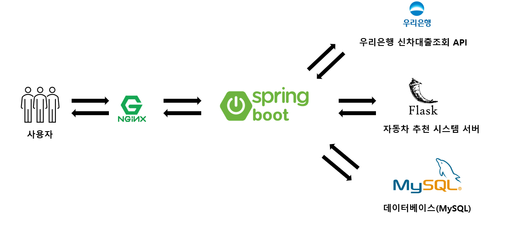

# Woori_Dream_Car_Dream
우리은행 해커톤 Spring boot 서버

# 기술
Spring Boot

# 서버 구조

# 화면 구성
### 시작화면

### 기본 항목 선택하기
사용자의 연소득과 대출한도는 반드시 입력해야합니다.

### 어떤 소비신념을 가지셨나요
2개 또는 3개의 사용자 소비신념을 선택합니다.

### 추천한 차들의 대출한도를 확인하세요

### 자세히 보기

# Youtube
https://youtu.be/KcUvs8I4H-I